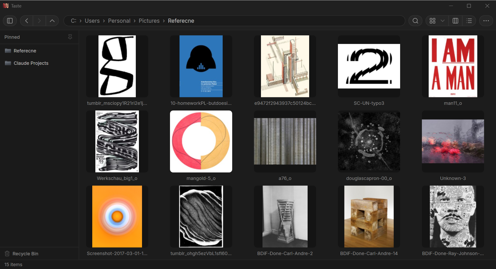
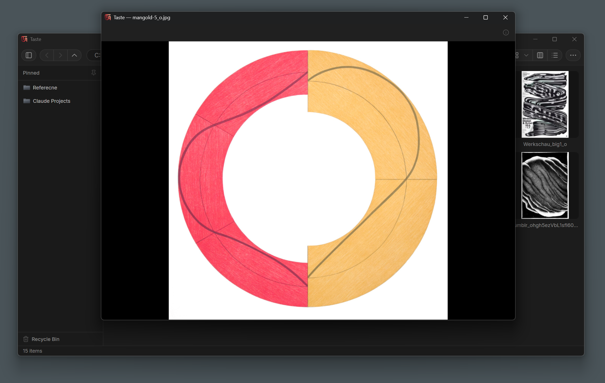

# Taste

A fast, media-focused replacement for Windows Explorer — built for browsing and reviewing images, GIFs, and videos, with a built-in floating preview window.

## Download

**[⬇ Download the latest installer](https://github.com/andresalyer/taste-viewer/releases/latest)**

Grab `Taste-Setup-x.x.x.exe` from the Releases page and run it. No .NET installation required — the app is self-contained.




## Features

- Grid, column, and list view modes for browsing folders
- Built-in floating preview window for images, GIFs (animated), and videos
- Fast, cached thumbnail generation with adjustable sizes
- Custom folder icons and thumbnails
- Keyboard and screen reader accessible
- In-app auto-update
- For video preview, zoom and video speed
- Quick delete, and undo delete for culling

## Requirements

- Windows 10/11 (x64)

## Building from source

Requires the [.NET 8 SDK](https://dotnet.microsoft.com/download/dotnet/8.0).

```
dotnet build TasteViewer.csproj -c Release
```

To build the installer, install [Inno Setup 6](https://jrsoftware.org/isinfo.php) and run:

```
dotnet publish TasteViewer.csproj -c Release -r win-x64 --self-contained true -p:PublishSingleFile=true
"C:\Program Files (x86)\Inno Setup 6\ISCC.exe" installer\Taste.iss
```
